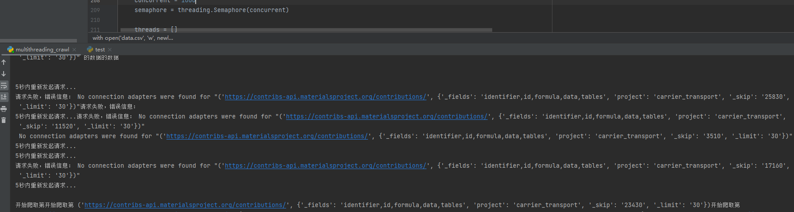
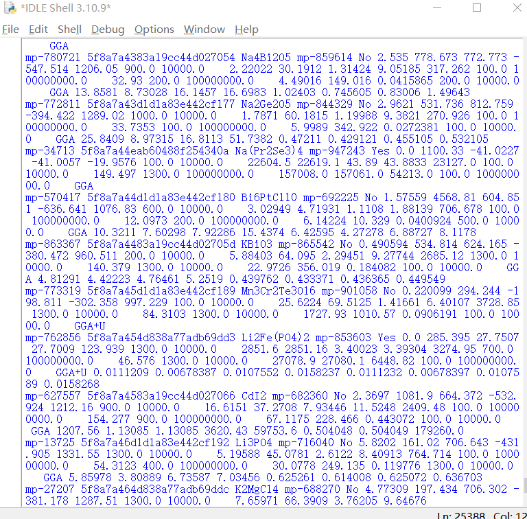
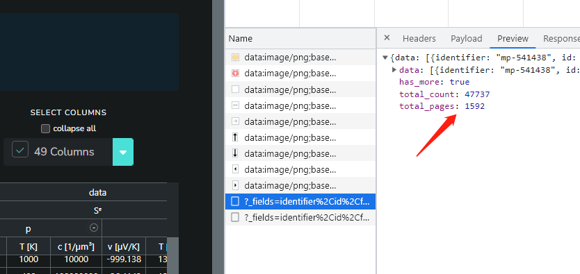
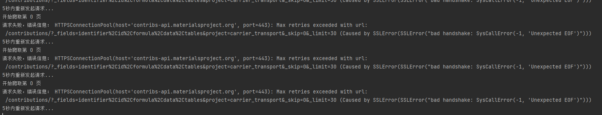
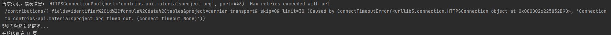
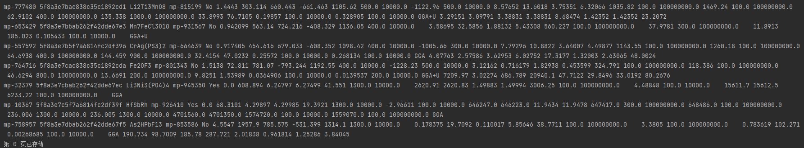
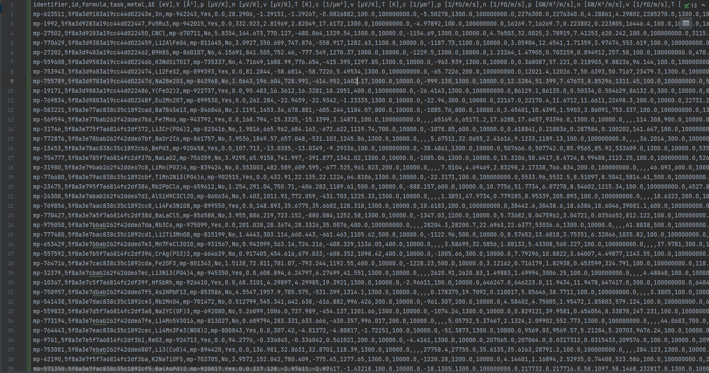

# MPContribs_ALL_DATA_CASE
This is an example of a crawler that grabs 10,000 data levels
https://contribs.materialsproject.org/projects/carrier_transport/

## Usage

~~~shell
#!/bin/bash

# Install third-party dependency libraries
pip install requests

# Run the sample multithreaded script
python multithreading_crawl.py
~~~

## About_multithreading:

**Total_urls:**

~~~python
url_list = []
    for page_number in range(total_pages):
        skip_value = str(page_number * page_size)
        params = {
            '_fields': 'identifier,id,formula,data,tables',
            'project': 'carrier_transport',
            '_skip': skip_value,
            '_limit': str(page_size)
        }

        url = 'https://contribs-api.materialsproject.org/contributions/'
        url_list.append((url, params))
~~~

**Do_or_Done:**

~~~python
# 控制线程数量
    concurrent = 1000
    semaphore = threading.Semaphore(concurrent)

    threads = []
    for url in url_list:
        semaphore.acquire()  # 获取信号量，控制并发数
        t = threading.Thread(target=crawl_data, args=(url,))
        threads.append(t)
        t.start()

    # 等待所有线程完成任务
    for t in threads:
        t.join()
        semaphore.release()  # 释放信号量
~~~

**Effect_picture:**

## About_SIngle:

- Store single-process thinking logic, but data is very slow
- crawl  about two days

~~~Python
with open('data.csv', 'w', newline='', encoding='utf-8') as file:
    writer = csv.writer(file)
    writer.writerow(["identifier", "id", "formula", "task", "metal", "ΔE [eV]", "V [ų]", "p [µV/K]", "n [µV/K]", "v [µV/K]", "T [K]", "c [1/µm³]", "v [µV/K]", "T [K]", "c [1/µm³]", "p [1/fΩ/m/s]", "n [1/fΩ/m/s]", "p [GW/K²/m/s]", "n [GW/K²/m/s]", "v [1/fΩ/m/s]",
                     "T [K]", "c [1/µm³]", "v [1/fΩ/m/s]", "T [K]", "c [1/µm³]", "v [GW/K²/m/s]", "T [K]", "c [1/µm³]", "v [GW/K²/m/s]", "T [K]", "c [1/µm³]", "p [GW/K/m/s]", "n [GW/K/m/s]", "v [GW/K/m/s]",  "T [K]", "c [1/µm³]", "v [GW/K/m/s]", "T [K]", "c [1/µm³]", "functional","ε̄ [mₑ]", "ε₁ [mₑ]", "ε₂ [mₑ]", "ε₃ [mₑ]", "ε̄ [mₑ]", "ε₁ [mₑ]", "ε₂ [mₑ]", "ε₃ [mₑ]"])

    for page_number in range(total_pages):
        skip_value = str(page_number * page_size)
        params = {
            '_fields': 'identifier,id,formula,data,tables',
            'project': 'carrier_transport',
            '_skip': skip_value,
            '_limit': str(page_size)
        }

        while True:
            try:
                headers['user-agent'] = random.choice(user_agents)  # 在每次请求时随机选择一个user-agent
                print('开始爬取第', page_number, '页')
                response = requests.get(url, headers=headers, params=params)
                print(response.status_code)
                response.raise_for_status()  # 如果返回的状态码不是200，则抛出异常
            except requests.exceptions.RequestException as e:
                print('请求失败，错误信息：', e)
                print('5秒内重新发起请求...')
                time.sleep(random.uniform(1, 5)) # 等待5秒再重新发起请求
                continue

            if response.status_code == 200:
                dataArray = response.json()['data']
                for data in dataArray:
                    # print(data)
                    identifier = data['identifier']
                    id = data['id']
                    formula = data['formula']

                    # dataTask 为第二层的对象 (data 的第二个大字段)
                    dataTask = data['data']
                    task = dataTask['task']
                    metal = dataTask['metal']
                    # 第三层的ΔE对象
                    ΔEValue = dataTask['ΔE']['value']
                    Vvalue = dataTask['V']['value']

                    # S 大字段下的两个小字段
                    S = dataTask['S']
                    Sp = S['p']['value']
                    Sn = S.get('n', {}).get('value', '')

                    # 大Sᵉ字段下的 中P 和 n
                    Sᵉ = dataTask.get('Sᵉ', {})
                    # 中字段P
                    SᵉP = Sᵉ.get('p', {})
                    # 中字段下的小字段
                    Pv = SᵉP.get('v', {}).get('value', '')  # 获取字段值，如果字段不存在则返回 空
                    PT = SᵉP.get('T', {}).get('value', '')  # 获取字段值，如果字段不存在则返回 None
                    Pc = SᵉP.get('c', {}).get('value', '')  # 获取字段值，如果字段不存在则返回 None
                    # 中字段n
                    Sᵉn = Sᵉ.get('n', {})
                    # 中字段下的小字段
                    Nv = Sᵉn.get('v', {}).get('value', '')  # 获取字段值，如果字段不存在则返回 None
                    NT = Sᵉn.get('T', {}).get('value', '')  # 获取字段值，如果字段不存在则返回 None
                    Nc = Sᵉn.get('c', {}).get('value', '')  # 获取字段值，如果字段不存在则返回 None

                    # data-> σ
                    Dσ = dataTask['σ']
                    σP = Dσ['p']['value']
                    σn = Dσ['n']['value']

                    # data -> PF
                    PF = dataTask['PF']
                    PFp = PF['p']['value']
                    PFn = PF['n']['value']

                    # data -> σᵉ
                    Oσᵉ = dataTask.get('σᵉ', {})
                    # σᵉ -> p
                    Oσᵉp = Oσᵉ.get('p', {})
                    Oσᵉpv = Oσᵉp.get('v', {}).get('value', '')  # 获取字段值，如果字段不存在则返回空字符串 ""
                    OσᵉpT = Oσᵉp.get('T', {}).get('value', '')  # 获取字段值，如果字段不存在则返回空字符串 ""
                    Oσᵉpc = Oσᵉp.get('c', {}).get('value', '')  # 获取字段值，如果字段不存在则返回空字符串 ""
                    # σᵉ -> n
                    Oσᵉn = Oσᵉ.get('n', {})
                    Oσᵉnv = Oσᵉn.get('v', {}).get('value', '')  # 获取字段值，如果字段不存在则返回空字符串 ""
                    OσᵉnT = Oσᵉn.get('T', {}).get('value', '')  # 获取字段值，如果字段不存在则返回空字符串 ""
                    Oσᵉnc = Oσᵉn.get('c', {}).get('value', '')  # 获取字段值，如果字段不存在则返回空字符串 ""

                    # data -> PFᵉ
                    PFᵉ = dataTask.get('PFᵉ', {})
                    # PFᵉ -> p
                    PFᵉp = PFᵉ.get('p', {})
                    PFᵉpv = PFᵉp.get('v', {}).get('value', '')  # 获取字段值，如果字段不存在则返回空字符串 ""
                    PFᵉpT = PFᵉp.get('T', {}).get('value', '')  # 获取字段值，如果字段不存在则返回空字符串 ""
                    PFᵉpc = PFᵉp.get('c', {}).get('value', '')  # 获取字段值，如果字段不存在则返回空字符串 ""
                    # PFᵉ -> n
                    PFᵉn = PFᵉ.get('n', {})
                    PFᵉnv = PFᵉn.get('v', {}).get('value', '')  # 获取字段值，如果字段不存在则返回空字符串 ""
                    PFᵉnT = PFᵉn.get('T', {}).get('value', '')  # 获取字段值，如果字段不存在则返回空字符串 ""
                    PFᵉnc = PFᵉn.get('c', {}).get('value', '')  # 获取字段值，如果字段不存在则返回空字符串 ""

                    # data -> κₑ
                    κₑ = dataTask['κₑ']
                    # κₑ -> n or p
                    κₑp = κₑ['p']['value']
                    κₑn = κₑ['n']['value']

                    # data -> κₑᵉ
                    κₑᵉ = dataTask.get('κₑᵉ', {})
                    # κₑᵉ -> p
                    κₑᵉP = κₑᵉ.get('p', {})
                    κₑᵉPv = κₑᵉP.get('v', {}).get('value', '')  # 获取字段值，如果字段不存在则返回空字符串 ""
                    κₑᵉPT = κₑᵉP.get('T', {}).get('value', '')  # 获取字段值，如果字段不存在则返回空字符串 ""
                    κₑᵉPc = κₑᵉP.get('c', {}).get('value', '')  # 获取字段值，如果字段不存在则返回空字符串 ""
                    # κₑᵉ -> n
                    κₑᵉn = κₑᵉ.get('n', {})
                    κₑᵉnv = κₑᵉn.get('v', {}).get('value', '')  # 获取字段值，如果字段不存在则返回空字符串 ""
                    κₑᵉnT = κₑᵉn.get('T', {}).get('value', '')  # 获取字段值，如果字段不存在则返回空字符串 ""
                    κₑᵉnc = κₑᵉn.get('c', {}).get('value', '')  # 获取字段值，如果字段不存在则返回空字符串 ""

                    # data -> functional
                    functional = dataTask['functional']

                    # data -> mₑᶜ
                    mₑᶜ = dataTask.get('mₑᶜ', {})
                    # mₑᶜ -> p
                    mₑᶜp = mₑᶜ.get('p', {})
                    mₑᶜp0 = mₑᶜp.get('ε̄', {}).get('value', '')  # 获取字段值，如果字段不存在则返回空字符串 ""
                    mₑᶜp1 = mₑᶜp.get('ε₁', {}).get('value', '')  # 获取字段值，如果字段不存在则返回空字符串 ""
                    mₑᶜp2 = mₑᶜp.get('ε₂', {}).get('value', '')  # 获取字段值，如果字段不存在则返回空字符串 ""
                    mₑᶜp3 = mₑᶜp.get('ε₃', {}).get('value', '')  # 获取字段值，如果字段不存在则返回空字符串 ""
                    # mₑᶜ -> n
                    mₑᶜn = mₑᶜ.get('n', {})
                    mₑᶜn0 = mₑᶜn.get('ε̄', {}).get('value', '')  # 获取字段值，如果字段不存在则返回空字符串 ""
                    mₑᶜn1 = mₑᶜn.get('ε₁', {}).get('value', '')  # 获取字段值，如果字段不存在则返回空字符串 ""
                    mₑᶜn2 = mₑᶜn.get('ε₂', {}).get('value', '')  # 获取字段值，如果字段不存在则返回空字符串 ""
                    mₑᶜn3 = mₑᶜn.get('ε₃', {}).get('value', '')  # 获取字段值，如果字段不存在则返回空字符串 ""

                    print(identifier, id, formula, task, metal, ΔEValue, Vvalue, Sp, Sn, Pv, PT, Pc, Nv, NT, Nc, σP, σn, PFp,
                         PFn, Oσᵉpv,
                         OσᵉpT, Oσᵉpc, Oσᵉnv, OσᵉnT, Oσᵉnc, PFᵉpv, PFᵉpT, PFᵉpc, PFᵉnv, PFᵉnT, PFᵉnc, κₑp, κₑn, κₑᵉPv, κₑᵉPT,
                         κₑᵉPc, κₑᵉnv, κₑᵉnT, κₑᵉnc, functional, mₑᶜp0, mₑᶜp1, mₑᶜp2, mₑᶜp3, mₑᶜn0, mₑᶜn1, mₑᶜn2, mₑᶜn3)
                    writer.writerow(
                        [identifier, id, formula, task, metal, ΔEValue, Vvalue, Sp, Sn, Pv, PT, Pc, Nv, NT, Nc, σP, σn, PFp,
                         PFn, Oσᵉpv,
                         OσᵉpT, Oσᵉpc, Oσᵉnv, OσᵉnT, Oσᵉnc, PFᵉpv, PFᵉpT, PFᵉpc, PFᵉnv, PFᵉnT, PFᵉnc, κₑp, κₑn, κₑᵉPv, κₑᵉPT,
                         κₑᵉPc, κₑᵉnv, κₑᵉnT, κₑᵉnc, functional, mₑᶜp0, mₑᶜp1, mₑᶜp2, mₑᶜp3, mₑᶜn0, mₑᶜn1, mₑᶜn2, mₑᶜn3])
                print('第', page_number, '页已存储')
                break

            else:
                print('请求失败:', response.status_code)
                print('5秒内重新发起请求...')
                time.sleep(random.uniform(1, 5))  # 等待5秒再重新发起请求

    # 处理所有数据
    print('ProJect Finished')
~~~

### Cause:

​	· Server monitoring

​	· Single processes cannot be concurrent

​	· There is no multi-agent pool support for masquerading

​	· Massive amount of data

### Part_Show

crawling_process:

Total_data:

​	Multiple mistakes：

Presentation data：

